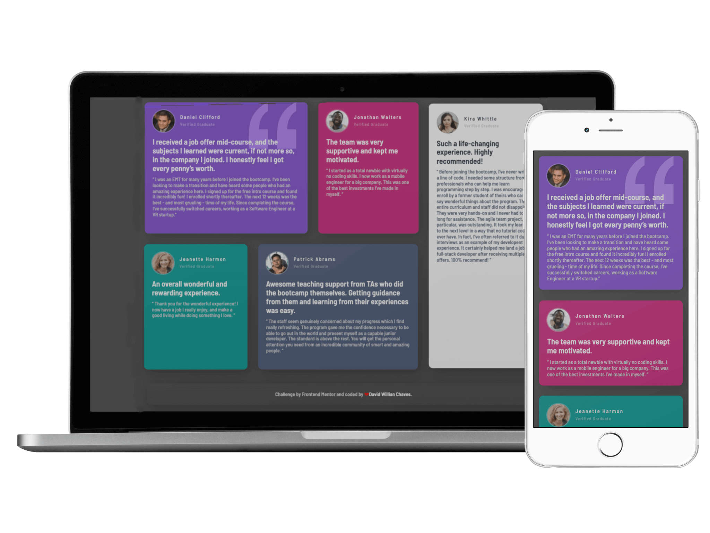

## Welcome !👋

Thanks for checking out this [Frontend Mentor](https://www.frontendmentor.io/) coding. This is my solution to the [Testimonials grid section](https://www.frontendmentor.io/challenges/testimonials-grid-section-Nnw6J7Un7). I have to build this application using only the preview images and the especifications.

<h1 align="center">Testimonials grid section</h1>



Contents

- [🔰 About](#about)
  - [Layout](#layout)
- [🚀 Tech](#tech)
- [🎨 Style Guide](#style-guide)
  - [Colors:](#colors)
  - [Typography:](#typography)
- 📌[Features](#features)
- [📧 Author](#author)

## About

This is responsive testimonials grid sections. I it a good challenge which helped me how to apply grid and focus effect on the card hovered with only CSS and I've also created my own design changes and personal improvements to the challenge elements. I'd recommend it to anyone still learning this concept.

### Layout


## Tech

- Semantic HTML5 markup
- CSS custom properties
- CSS Grid
- Mobile-first workflow

## Style Guide

### Colors:

```css
:root {
    --Moderate-violet: hsl(263, 55%, 52%);
    --dark-grayish-blue: hsl(217, 19%, 35%);
    --dark-blackish-blue: hsl(219, 29%, 14%);
    --Light-gray: hsl(0, 0%, 81%);
    --Light-grayish-blue: hsl(210, 46%, 95%);
}
```

## Typography:

### Body

* Font size: 1.3rem;

### Font

* font-family: 'Barlow Semi Condensed', sans-serif;
  `<br>`
* font-weight: 500 e 600
  `<br>`
  (you can find the font in [Google Font](https://fonts.google.com/))

## Features

* 🎨 Focus effect on hover.
* 👨‍🔬 Focus effect on card hovered.
* 📱 New media query breakpoint for tablet screens
* 😎 Custom Design.

## Author

**David Willian**

- https://www.linkedin.com/in/david0chaves/
- https://github.com/davidchaves
- https://twitter.com/david__chaves
- https://www.instagram.com/david_.chaves/
